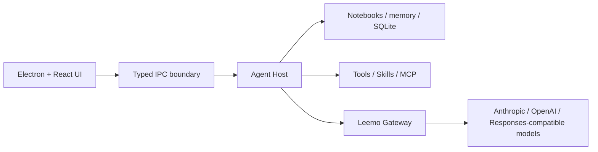

<div align="center">
  
  <h1>Leemo</h1>
  <p><strong>A local-first desktop AI agent that can think things through with you, work across files and tools, and carry the context forward.</strong></p>
  <p>
    <a href="README.md">简体中文</a> ·
    <a href="https://github.com/CheaperjamRen/leemo/releases/latest">Download for Windows</a> ·
    <a href="#quick-start">Quick start</a> ·
    <a href="#contributing">Contributing</a>
  </p>
  <p>
    
    
    <a href="https://github.com/CheaperjamRen/leemo/actions/workflows/ci.yml"></a>
    <a href="LICENSE"></a>
  </p>
</div>


Leemo brings `momo`, a conversational companion, and a local workbench into one desktop app. You can talk through an idea or a decision, then open a real folder as a notebook and let the same agent read, search, edit, run tools, and preserve the context under an explicit permission boundary.

Leemo is not intended to be another chat wrapper. Its goal is to make a capable desktop agent approachable to people who do not live in a terminal, without taking away model choice, ownership of local files, or understandable control over actions.

> [!IMPORTANT]
> Leemo is an early, Windows-first preview. Download the installer from [Releases](https://github.com/CheaperjamRen/leemo/releases/latest), or run it from source. The installer does not yet have a commercial code-signing certificate, so Windows SmartScreen may warn; verify its SHA-256 against the release notes before running it.

## What you can do with Leemo

- **Think with momo**: untangle ideas, compare options, and work through learning or career decisions. momo can have a point of view without silently changing your request.
- **Give the agent a real workspace**: create a notebook or attach an existing folder. Conversations, files, and project memory stay with that notebook.
- **Finish local work**: read, search, create, and edit files; run commands; manage multi-step work; and review a compact file-change receipt when the job is done.
- **Work with the web and research sources**: use web search, arXiv, Doubao Search, Metaso, Google, and controlled browser automation.
- **Keep work moving on schedule**: create one-off, daily, or weekly local tasks, inspect their runs, and decide what to do with jobs missed while the computer was off.
- **Extend the agent**: manage local Skills, custom MCP servers, and model providers. Skills can be enabled per user without depending on a Leemo-operated cloud marketplace.
- **Carry long-term context responsibly**: global profile and notebook memory are separated, reviewable, editable, replaceable, and deletable. Ordinary output does not get dumped into memory.

## Core design

| Area | How Leemo approaches it |
| --- | --- |
| Companion and workbench | One momo, one tool layer, and one memory model; conversation and execution are not separate products |
| Notebooks | A real local folder is the project boundary, whether created in Leemo or attached from disk |
| Models | 26 preset connections across official APIs, Coding/Token Plans, aggregators, and local runtimes |
| Protocols | Native Anthropic, OpenAI Chat Completions, and OpenAI Responses routing, plus custom compatible endpoints |
| Permissions | Clear read-only, accept-edits, ask-first, and full-access modes without silently widening dangerous approvals |
| Memory | Local ledgers, global/notebook scopes, temporal and source metadata, and user-visible editing and deletion |
| Skills / MCP | Curated local Skills, installation and toggles, source metadata, and custom stdio/SSE MCP servers |
| Documents | PDF reading, Markdown preview/editing, Word/PPTX/Excel creation and reading, and precise copy-based Word edits |

Preset entries include DeepSeek, GLM, Kimi, Qwen, OpenAI, Anthropic, Google Gemini, MiniMax, Doubao, MiMo, NVIDIA API Catalog, SiliconFlow, OpenRouter, TokenFlux, ModelScope, Groq, Huawei Cloud MaaS, Ollama, LM Studio, and several Coding/Token Plans. Available models, credentials, and network requirements remain provider-specific.

A preset means Leemo provides the corresponding configuration and protocol path. It does not mean all 26 services consume live quota in every release test; availability still depends on the provider, account permissions, and current network.

## Quick start

### Requirements

- Windows 10/11 x64
- Node.js 20 or newer
- npm
- At least one model API key, plan credential, or local model server

### Run from source

```powershell
git clone https://github.com/CheaperjamRen/leemo.git
cd leemo
npm ci
npm run electron:dev
```

On first launch:

1. Open **Settings → Models** and choose a provider or custom compatible endpoint.
2. Enter credentials, discover or enter a model, and run the lightweight connection test.
3. Return to companion mode, or create/open a notebook in the workbench.

Development builds also support an optional `.env` bootstrap. See [`.env.example`](.env.example), and never commit real credentials.

### Build a Windows installer

```powershell
npm run electron:pack
```

Artifacts are written to `dist-package/`. The public build includes Leemo's base document tools and does not require a private advanced Office bundle. See [`bundled-skills/office/README.md`](bundled-skills/office/README.md) for the optional, locally supplied extension boundary.

## Data and privacy

- Notebooks, artifacts, and project memory live in user-selected local folders. Application state lives in Leemo's local app-data directory.
- Model credentials are handled in the Electron main process and encrypted with the operating system's secure storage. Plaintext credentials are never returned over renderer IPC.
- When you invoke a cloud model, search provider, or third-party MCP server, the necessary content is sent to that service. Local-first does not mean all inference is offline.
- Skills and MCP servers can run code or access external services. Install trusted sources and choose a permission mode appropriate for the task.

Do not post credentials or private files in a public report. See [`SECURITY.md`](SECURITY.md).

## Architecture



Main stack: Electron, React, TypeScript, Vite, Zustand, SQLite, Claude Agent SDK, Model Context Protocol, and Vitest.

## Roadmap

**Must work first**: the general desktop-agent baseline across conversation, files, search, browser use, model routing, permissions, Skills/MCP, scheduled tasks, and restart continuity.

**Then go deeper**: English learning, paper reading with visual explanations, university and career planning, and resume/JD workflows.

**Explicitly not now**: an operated Skill marketplace, a heavy cloud platform, or enterprise operations. We will validate the core experience before expanding the surface area.

Commits, tests, and GitHub Issues are the source of truth. The README will not use a feature count to hide an unfinished user journey.

## Contributing

Bug reports, product-friction findings, provider integrations, verifiable Skills, and small complete improvements are welcome. Read [`CONTRIBUTING.md`](CONTRIBUTING.md) and [`AGENTS.md`](AGENTS.md) before starting.

```powershell
npm run typecheck
npm test
npm run verify:bundled-skills
npm run build
npm run build:main
```

## License

Leemo-owned source code is available under the [Apache License 2.0](LICENSE). Third-party dependencies, runtimes, and Skills retain their own licenses or terms. See [`THIRD_PARTY_NOTICES.md`](THIRD_PARTY_NOTICES.md).
