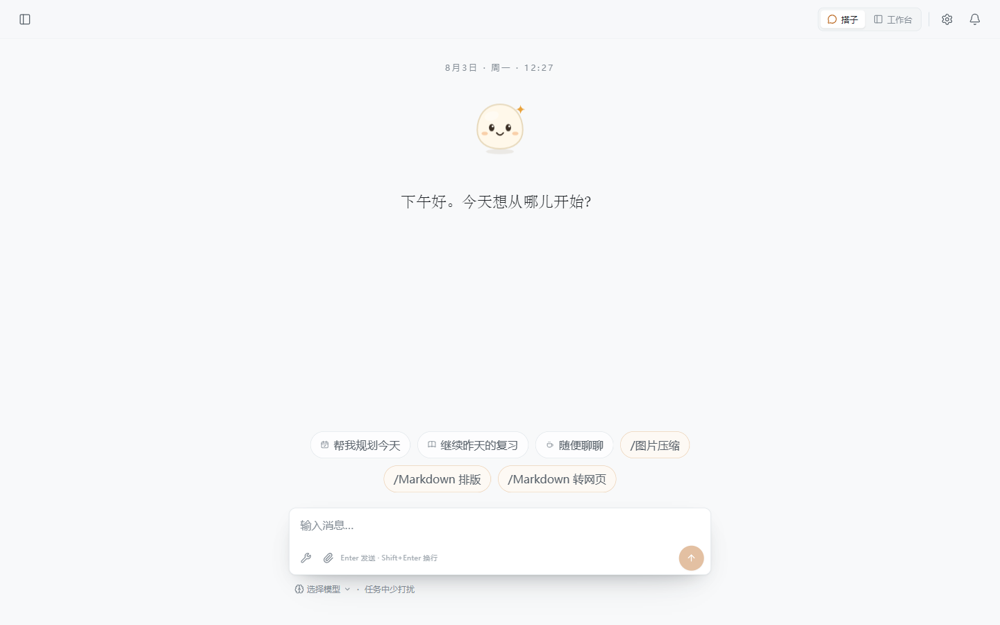

  
  <h1>Leemo</h1>
  
<strong>A desktop AI companion that remembers you, understands you, and stays with the work until it is done.</strong>

  
Think it through with momo, then keep moving through real files and tools.

  

    <a href="https://github.com/CheaperjamRen/leemo/releases/latest"><strong>Download for Windows</strong></a> ·
    <a href="README.md">简体中文</a> ·
    <a href="https://github.com/CheaperjamRen/leemo/issues">Report an issue</a>
  

  

    
    
    
  

Most AI only knows the version of you inside the current chat box. When the answer ends, the relationship resets. Leemo is built around a different idea.

Inside Leemo lives **momo**, a companion that gradually learns what matters to you, what you are working through, how you make decisions, and which goals carry real weight. momo can think with you, then move into a real folder, read material, use tools, and turn the conversation into finished work.

Bring momo a half-formed idea and work out the real question together. Or hand over coursework, a resume, a paper, or a messy project folder and let Leemo research, organize, and create useful output. Come back days later without repeating your introduction or reconstructing why the work mattered.

When you are uncertain, momo should feel like a thoughtful friend with a real point of view. Once you decide to act, it becomes a reliable agent willing to carry the work through.

## More than remembering a sentence

momo separates what it learns into long-term preferences, changing circumstances, and context that belongs only to a particular notebook. It tries to understand not only what you said, but when it became true, why it matters, and whether it has changed.

That understanding returns naturally in later conversations and tasks. momo can remember what you value when discussing a decision, your pace when learning, and where you actually want to go when reviewing career material. Moving into the workbench does not replace it with a cold, forgetful tool.

momo can disagree and point out a problem, but it will not rewrite an ordinary request or take the steering wheel away from you. It distinguishes your words from its own inferences, avoids treating every passing remark as permanent memory, and keeps memory reviewable, editable, and deletable.

## One momo, two ways to work

### Companion mode

For conversation, clearer thinking, difficult choices, learning, career questions, and everyday decisions. momo can offer a real point of view without rewriting your request or pushing ordinary work back onto you.

### Workbench mode

For getting the work done. Open any local folder as a notebook and momo can read material, create and edit files, search the web, and use tools within the permission level you choose. Conversations, artifacts, and project context stay connected to that notebook.

## What Leemo can do

- **Work with local material**: read, search, organize, and edit files, then turn conversation into useful artifacts.
- **Read and create documents**: work with PDF, Markdown, Word, Excel, and PowerPoint files.
- **Research and keep moving**: use web search, academic sources, and browser tools to turn an answer into the next action.
- **Handle multi-step work**: run tools, track tasks and progress, and show a compact receipt of what changed.
- **Run on your schedule**: create one-off, daily, or weekly tasks and review their results and run history.
- **Remember what matters**: separate long-term preferences, current circumstances, and notebook-specific context. Memory stays reviewable, editable, and deletable.
- **Use the models you prefer**: connect popular model providers, aggregators, or local runtimes, or enter your own endpoint.
- **Extend the agent**: add workflows, sources, and tools through Skills and MCP instead of waiting for a fixed feature list.

## Download and install

Leemo currently supports Windows 10/11 x64.

1. Open the [latest release](https://github.com/CheaperjamRen/leemo/releases/latest).
2. Download and run `Leemo-Setup-*.exe`.
3. Launch Leemo and follow the model setup flow.

Leemo is still in preview and the installer does not yet carry a commercial code-signing certificate. If Windows SmartScreen displays a warning, make sure the installer came from this repository's Release page and compare its SHA-256 with the value published there.

## Your first session: from setup to a real result

The current preview requires an API key from a supported model service, or a local model runtime already running on your computer.

1. Launch Leemo and open **Settings → Models**.
2. Choose the service you already use. Common settings are prefilled, so you normally only need to paste the API key. Enter a Base URL only when your provider explicitly supplies one.
3. Select **Test connection**, save the setup, and choose that model back in companion mode.
4. Tell momo about something you are currently facing or trying to finish. When files are involved, enter the workbench and open the relevant local folder as a notebook.
5. Choose how much Leemo may do: ask before important actions, or execute directly after you grant full access.

Try one of these as a first prompt:

- "I am preparing for my next job. Get to know my experience and goals, then tell me what is most worth doing first."
- "Help me truly understand this course material, then write a study plan I can finish today into the notebook."
- "Review this resume folder against my target role. Find the issues most likely to hurt my chances and show me the edit plan first."

Leemo includes setup paths for popular choices such as DeepSeek, Kimi, Zhipu GLM, Qwen, OpenAI, Anthropic, Gemini, MiniMax, Doubao, MiMo, NVIDIA, SiliconFlow, OpenRouter, TokenFlux, Ollama, and LM Studio.

## Local first, under your control

- A notebook is the real local folder you choose, not a proprietary container.
- Model credentials are encrypted with the operating system's secure storage and are not passed through the interface process as plaintext.
- File changes, command execution, and external access follow the permission level you select.
- Memory is not an invisible black box: you can review what momo remembers, correct it, or remove it.
- Cloud models, search services, and third-party tools receive the content required to complete the actions you request. Local-first does not mean every inference runs locally.

## Feedback and contributions

Found a problem or have a product suggestion? Open a [GitHub Issue](https://github.com/CheaperjamRen/leemo/issues). Do not include API keys, private files, or other sensitive information in a public report. See the [security policy](SECURITY.md) for security-related reports.

To contribute code, start with the [contributing guide](CONTRIBUTING.md).

## License

Leemo-owned source code is available under the [Apache License 2.0](LICENSE). Third-party components retain their own licenses or terms; see [third-party notices](THIRD_PARTY_NOTICES.md).
