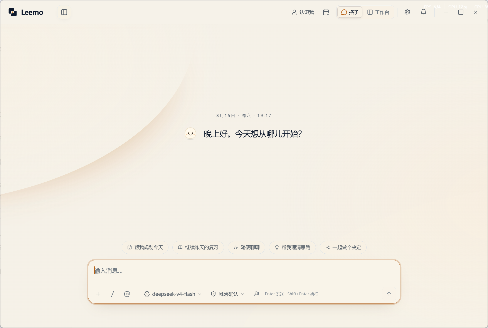
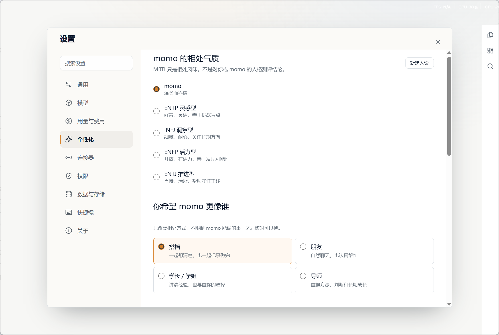
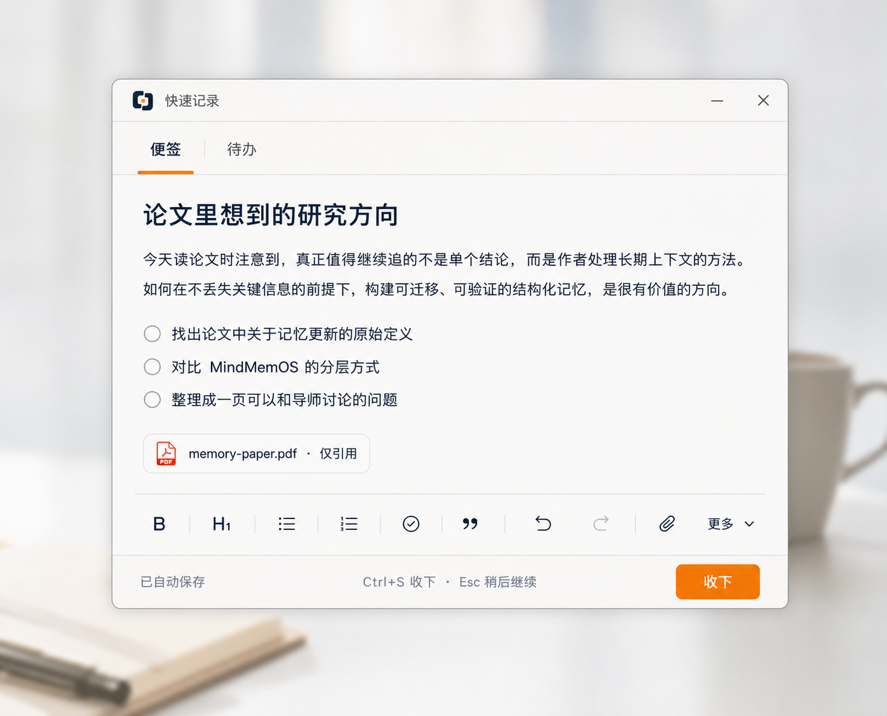
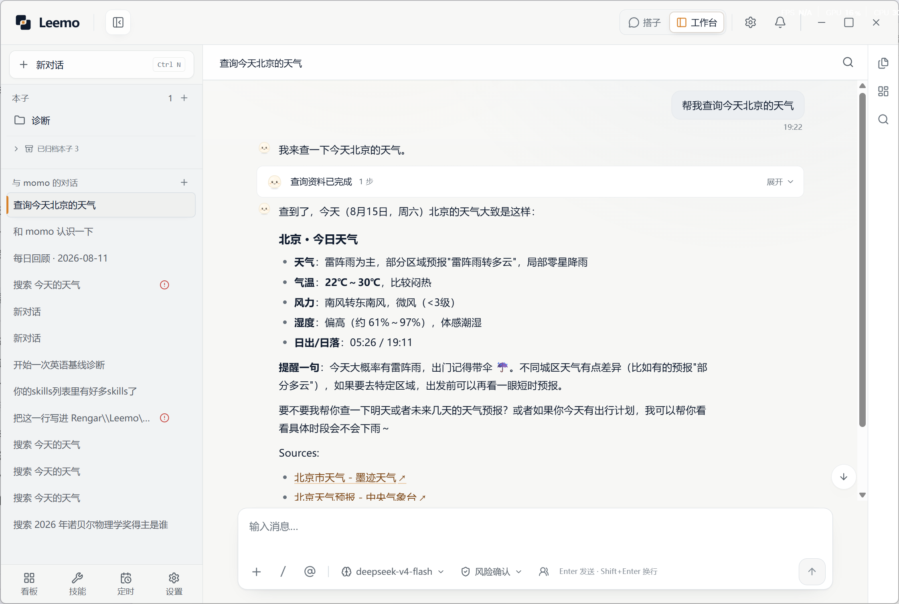
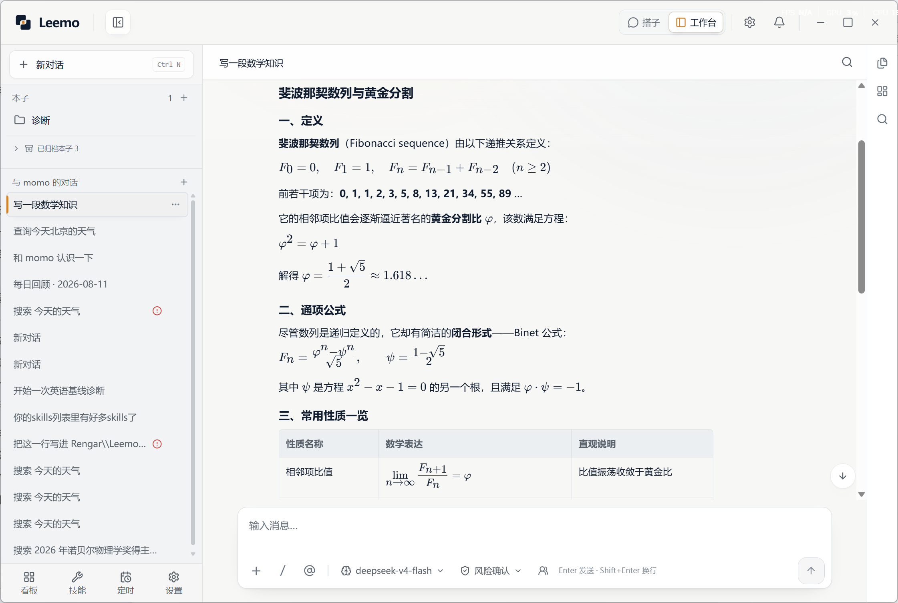
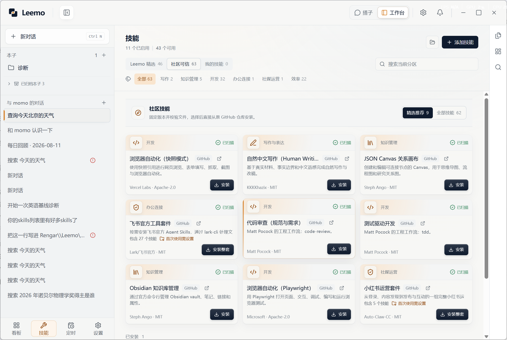

  
  <h1>Leemo</h1>
  
<strong>一个会记得你，也会在电脑里把事情做完的桌面 AI Agent。</strong>

  
从随手记下一个念头，到本地文件里留下结果。

  

    <a href="https://github.com/CheaperjamRen/leemo/releases/latest"><strong>下载 Windows 版</strong></a> ·
    <a href="README.en.md">English</a> ·
    <a href="https://github.com/CheaperjamRen/leemo/issues">反馈问题</a>
  

  

    
    
    
    
  

## Leemo 是什么

Leemo 是一个本地优先的桌面 AI Agent，适合持续使用电脑学习/工作，需要把一件事情推进几天甚至一周的人，也适合需要同时推进多项事情，但不想翻来翻去找不到进度和成果的人。

住在里面的AI（它叫**momo**）会记住你的偏好和近况；当你打开一个本地文件夹，它也会带上这个项目的背景继续工作。

你可以先在搭子态说出一个还没想明白的问题。方向确定后，打开对应的本地文件夹，momo 会在工作台里查资料、调用工具，把结果写回这个文件夹。途中冒出来的想法可以先放进快捷便签，回到 Leemo 后再整理为当天要做的事。任务结束后，进度和成果仍留在原来的本子里。

一次真实的使用可以从很小的动作开始：读论文时按下 `Alt + N`，记下刚想到的研究方向；回到 Leemo，把这张便签交给 momo 梳理，再打开论文文件夹继续检索。写好的笔记会留在本子里，下一步也会出现在任务—成果概览中。

## 同一个 momo，两种状态

搭子态负责陪你把事情想清楚。你可以聊最近在忙什么，请 momo 帮你梳理选择，也可以在行动之前补充背景。

准备动手时，点一下就能进入工作台。刚才的上下文会跟着过去。两种状态共用同一套记忆和任务数据，本子里的文件也始终围绕同一件事组织。

你可以在「设置 → 个性化」中调整 momo 的相处气质和关系定位。它会结合你的长期偏好与当前本子的背景继续交流；近况发生变化后，也会更新对你的认识。记忆页会列出已经保存的内容，你可以随时修改或删除。

momo 也许会提出不同意见，最后仍按你的决定行动。

## 想到就记，回到 Leemo 再整理

按下 `Alt + N`，快捷记录会直接出现在当前桌面。你可以写一张便签，也可以切到待办。便签支持富文本和清单，也可以附上文件；输入过程会自动保存。待办可以设置时间与提醒，重复任务也能单独安排。

记录时，momo 会保持安静。你先把内容写下来，之后再决定是否让它介入。

回到 Leemo，今日面板会把尚未处理的便签和当天待办放在一起，最近生成的成果也能从这里找到。你可以先整理顺序，再把其中一项交给 momo。

一条便签也可以直接成为下一次工作的入口。在对话里通过 `@` 引用它，momo 就能接着梳理问题、查找资料或进入本子执行。便签不必停留在便签里。

<em>快捷记录界面设计预览</em>

## 打开一个本子，把事情做完

每个「本子」都对应电脑上的一个真实文件夹。你可以打开课程资料，也可以打开正在准备的求职项目。左侧保留本子和历史对话，文件可以在右侧直接查看；Markdown 文件支持阅读、编辑和自动保存。

你给出目标后，momo 会先把任务步骤整理清楚，再在你授权的范围内读写文件。需要外部信息时，它会联网检索并保留来源。需要操作具体页面时，它也能使用浏览器，并在获得权限后操作 Windows 桌面。

复杂工作可以交给子 Agent 分开处理。需要反复执行的任务可以设定时间，之后直接回来查看运行结果。PDF 与常见 Office 文件也可以放进本子，由 momo 阅读或生成。

任务进行时，工具过程会显示在界面中。你可以随时补充要求；遇到敏感动作时，Leemo 会停下来等你确认。执行失败后可以重试或继续，不必从头开始。

完成后的文件会进入成果入口，并保留对应的来源对话。任务—成果概览会自动更新，让你看到任务已经推进到哪里、留下了哪些文件。几天后重新打开本子，下一步从哪里继续仍然清楚。

全局搜索可以找回过去的对话和文件，也能直接定位一份成果。公式和表格可以在回答区中直接查看，检索得到的来源链接也会保留。

  
  

## 模型由你选择

Leemo 已准备常见国内模型的连接入口，也支持海外订阅与本地模型。打开「设置 → 模型」，登录订阅或填写密钥，测试连接后即可在对话框中切换。自定义 API 也可以直接接入。

不同任务可以使用不同模型。你可以根据效果和预算随时调整。

模型发生变化后，本子里的文件仍在原来的位置。momo 的记忆和已经安装的 Skills 也会继续保留，你不需要重新搭一套工作环境。

## Skill Hub 把好方法留下来

当你找到一套好用的工作方法，可以把它做成 Skill 交给 momo。例如，把你习惯的简历检查步骤保存下来；下次处理新的求职材料时，momo 会继续按照这套方法执行。

Skill Hub 收录 Leemo 精选与社区 Skill（我手动整理了全网好用的开源skill集合），并展示每项能力的用途、来源和扫描状态。找到需要的 Skill 后，可以直接安装并启用。回到对话框输入 `/` 即可调用，你自己的 Skill 也能从本地目录加入。

## 文件留在本地，执行由你授权

本子就是你选择的本地文件夹，生成内容也会以普通文件保存在其中。你可以继续用熟悉的软件编辑这些文件，移动和交付也按普通文件处理。

API Key 由 Windows 安全存储保护。文件修改和命令执行遵循当前权限；需要访问外部服务时，同一套授权规则仍然有效。你可以让 Leemo 在关键动作前询问，也可以为目标明确的任务授予更直接的执行权限。

使用云端模型、搜索服务或其他第三方工具时，完成当前任务所需的内容会发送给对应服务。

## 下载与开始使用

Leemo 当前支持 Windows 10/11 x64。

1. 前往 [最新版本页面](https://github.com/CheaperjamRen/leemo/releases/latest) 下载安装包。
2. 启动 Leemo，在「设置 → 模型」连接你正在使用的模型。
3. 先告诉 momo 最近在处理什么。需要动手时，再打开一个本地文件夹作为本子。
4. 随时按下 `Alt + N`，记下途中冒出来的想法或待办。

第一条消息可以这样写：

> 我正在准备秋招。先了解我的经历和目标，再帮我确定这周最该推进的事。

也可以直接交付文件任务：

> 打开这份课程资料，整理重点，并在本子里生成一份三天复习计划。

Leemo 目前处于预览阶段。Windows 安装包暂未购买商业代码签名证书；SmartScreen 弹出提醒时，请确认文件来自本仓库的 Release 页面，并核对 Release 公布的 SHA-256。

## 反馈与参与

欢迎通过 [GitHub Issues](https://github.com/CheaperjamRen/leemo/issues) 提交问题和产品建议。公开反馈请移除 API Key 和私人文件。安全问题请参阅 [SECURITY.md](SECURITY.md)。

贡献代码前，请先阅读 [CONTRIBUTING.md](CONTRIBUTING.md)。

## 许可证

Leemo 自有源码采用 [Apache License 2.0](LICENSE)。第三方组件保留各自的许可证或使用条款，详见 [THIRD_PARTY_NOTICES.md](THIRD_PARTY_NOTICES.md)。
