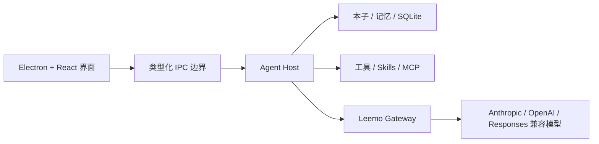

<div align="center">
  
  <h1>Leemo</h1>
  <p><strong>本地优先的桌面 AI Agent：既能陪你把事情想清楚，也能操作文件、浏览器和工具，把事情真正做完。</strong></p>
  <p>
    <a href="README.en.md">English</a> ·
    <a href="https://github.com/CheaperjamRen/leemo/releases/latest">下载 Windows 版</a> ·
    <a href="#快速开始">快速开始</a> ·
    <a href="#参与贡献">参与贡献</a>
  </p>
  <p>
    
    
    <a href="https://github.com/CheaperjamRen/leemo/actions/workflows/ci.yml"></a>
    <a href="LICENSE"></a>
  </p>
</div>


Leemo 把聊天搭子 `momo` 和本地工作台放在同一个桌面应用里。你可以自然地聊想法、做决定，也可以把一个真实文件夹作为「本子」交给它，让它在明确的权限边界内阅读资料、搜索信息、修改文件、运行工具并留下可继续的上下文。

Leemo 的目标不是再做一个聊天壳，而是让不熟悉命令行的用户也能获得完整桌面 Agent 的执行力，同时保留可选择的模型、本地文件所有权和可理解的授权过程。

> [!IMPORTANT]
> Leemo 目前是 Windows 优先的早期预览版。可从 [Releases](https://github.com/CheaperjamRen/leemo/releases/latest) 下载安装包，也可以从源码运行。安装包尚未购买商业代码签名证书，Windows SmartScreen 可能提示风险；请核对 Release 页面公布的 SHA-256 后再运行。

## 你可以用 Leemo 做什么

- **和 momo 商量事情**：梳理想法、比较方案、做学习或求职决策；momo 可以有判断，但不会擅自改写你的任务。
- **让 Agent 进入真实工作区**：新建本子或直接打开已有文件夹，对话、文件和项目记忆跟着本子走。
- **完成本地任务**：读取、搜索、创建和修改文件，运行命令，管理多步任务，并在完成后给出轻量文件变更回执。
- **连接网页与资料源**：支持联网搜索、arXiv、豆包搜索、秘塔搜索、Google，以及可控的浏览器自动化。
- **按时继续工作**：创建一次、每天或每周的本地定时任务，查看运行记录，并处理关机期间错过的任务。
- **扩展自己的 Agent**：管理本地 Skills、自定义 MCP 服务和模型服务商；技能可以按需启停，不需要依赖 Leemo 自营云市场。
- **保留长期上下文**：全局画像与本子记忆分层保存，支持查看、编辑、删除、替代和撤销，不把普通产物混进记忆区。

## 核心设计

| 能力 | Leemo 的做法 |
| --- | --- |
| 搭子与工作台 | 同一个 momo、同一套工具与记忆；聊天和执行不再是两个割裂产品 |
| 本子 | 真实本地文件夹就是项目边界，可新建，也可挂载已有目录 |
| 模型 | 26 个预设接入，覆盖官方 API、Coding/Token Plan、聚合服务与本地模型 |
| 协议 | 原生 Anthropic、OpenAI Chat Completions 与 OpenAI Responses 路由，可接自定义兼容端点 |
| 权限 | 只读、接受编辑、逐次确认与完全访问等清晰档位；危险动作不被普通授权误放大 |
| 记忆 | 本地账本、全局/本子分层、时间与来源治理，用户始终可见、可改、可删 |
| Skills / MCP | 精选技能、本地安装、启停、来源信息、自定义 stdio/SSE MCP |
| 文档 | PDF 阅读、Markdown 预览与编辑、Word/PPTX/Excel 创建和读取、精确 Word 副本修改 |

预设模型入口包括 DeepSeek、GLM、Kimi、通义千问、OpenAI、Anthropic、Google Gemini、MiniMax、豆包、MiMo、NVIDIA API Catalog、硅基流动、OpenRouter、TokenFlux、ModelScope、Groq、华为云 MaaS、Ollama、LM Studio，以及多家 Coding/Token Plan。模型列表、鉴权方式和网络要求由各服务商决定。

预设入口代表 Leemo 已提供相应配置与协议路径，不代表 26 家服务都在每次发布中消耗真实额度逐一验活；真实可用性仍取决于服务商、账号权限和当前网络。

## 快速开始

### 环境要求

- Windows 10/11 x64
- Node.js 20 或更新版本
- npm
- 至少一个可用的模型 API Key、套餐凭据或本地模型服务

### 从源码运行

```powershell
git clone https://github.com/CheaperjamRen/leemo.git
cd leemo
npm ci
npm run electron:dev
```

首次打开后：

1. 进入「设置 → 模型」，选择服务商或自定义兼容端点。
2. 填写凭据、拉取或填写模型，并运行轻量连接测试。
3. 回到搭子态直接聊天，或在工作台新建/打开一个本子。

开发环境也支持 `.env` 作为可选的启动配置，字段示例见 [`.env.example`](.env.example)。不要提交真实凭据。

### 构建 Windows 安装包

```powershell
npm run electron:pack
```

产物写入 `dist-package/`。公开构建包含 Leemo 的基础文档能力，不依赖高级 Office 私有包；可选离线 Office 扩展的维护边界见 [`bundled-skills/office/README.md`](bundled-skills/office/README.md)。

## 数据与隐私

- 本子、成果和项目记忆保存在用户选择的本地文件夹中；应用状态保存在 Leemo 的本地应用数据目录。
- 模型凭据只在 Electron 主进程处理，并使用系统安全存储加密；不会通过渲染层 IPC 返回明文。
- 当你调用云模型、搜索源或第三方 MCP 时，必要内容会发送到你选择的服务。Leemo 是本地优先，不等于所有推理都离线。
- Skills 和 MCP 可以执行代码或访问外部服务。只安装你信任的来源，并根据任务选择合适的权限档。

安全问题请不要公开附带凭据或私人文件，参见 [`SECURITY.md`](SECURITY.md)。

## 技术结构



主要技术栈：Electron、React、TypeScript、Vite、Zustand、SQLite、Claude Agent SDK、Model Context Protocol、Vitest。

## 当前路线

**现在必须做好**：通用桌面 Agent 的对话、文件、搜索、浏览器、模型、权限、Skills/MCP、定时任务和跨重启连续性。

**随后做深**：英语学习、论文阅读与可视化讲解、大学与职业规划、简历/JD 等场景化能力。

**暂不扩张**：自营 Skill 商店、重云端平台和企业级运维。先让核心体验可验证，再由真实用户反馈决定投入。

具体状态以提交、测试和 GitHub Issues 为准；README 不用功能数量掩盖尚未打通的用户路径。

## 参与贡献

欢迎提交 bug、产品体验问题、Provider 适配、可验证的 Skills 与小而完整的改进。开始前请阅读 [`CONTRIBUTING.md`](CONTRIBUTING.md) 和 [`AGENTS.md`](AGENTS.md)。

```powershell
npm run typecheck
npm test
npm run verify:bundled-skills
npm run build
npm run build:main
```

## 许可证

Leemo 自有源码采用 [Apache License 2.0](LICENSE)。第三方依赖、运行时和 Skills 保留各自许可证或使用条款，详见 [`THIRD_PARTY_NOTICES.md`](THIRD_PARTY_NOTICES.md)。
