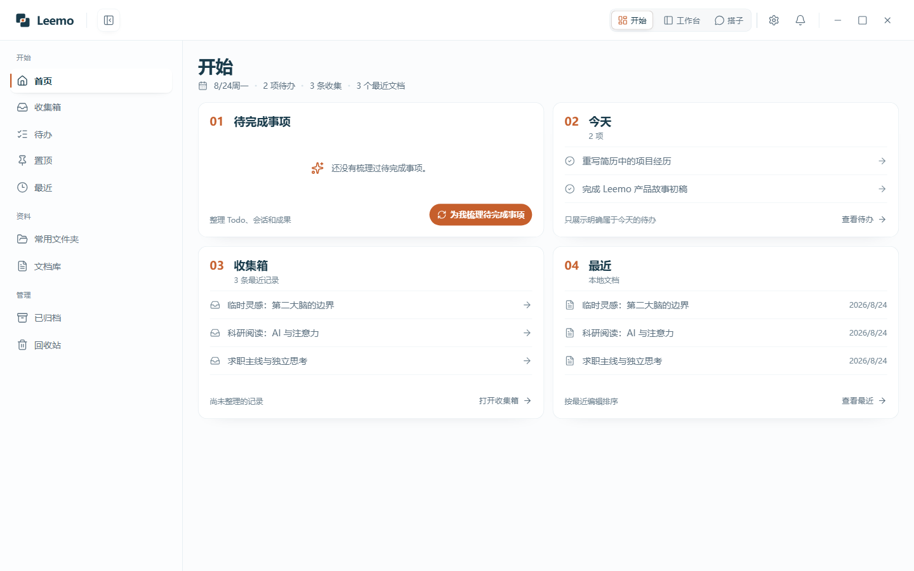
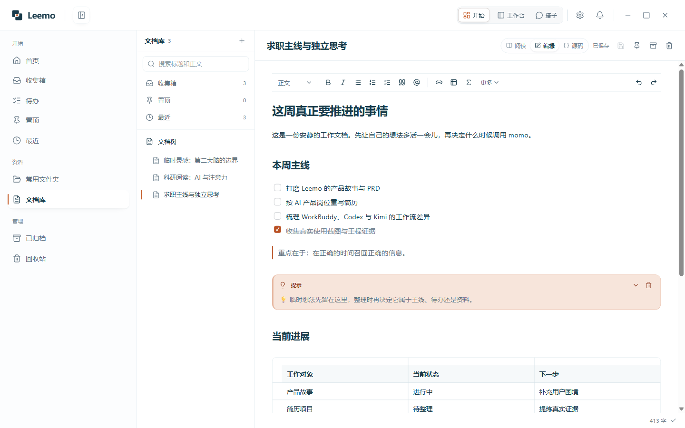
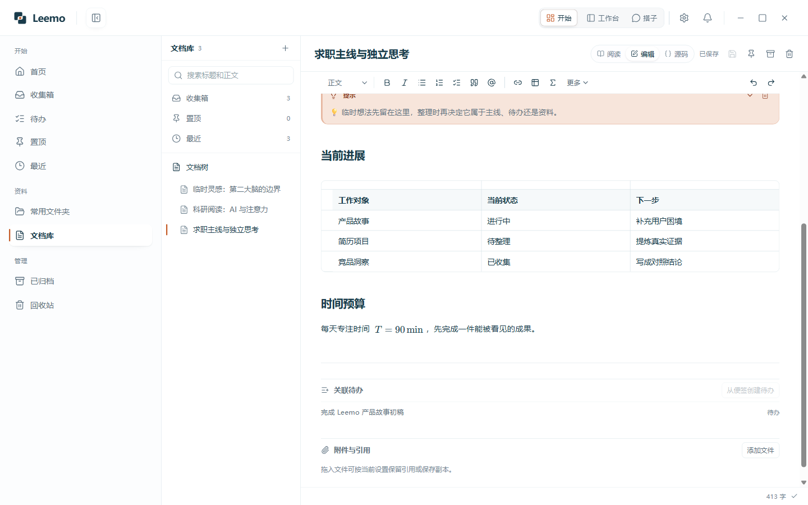
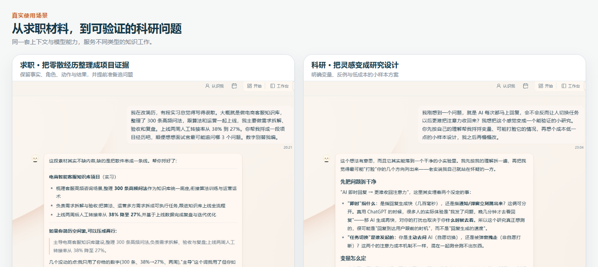
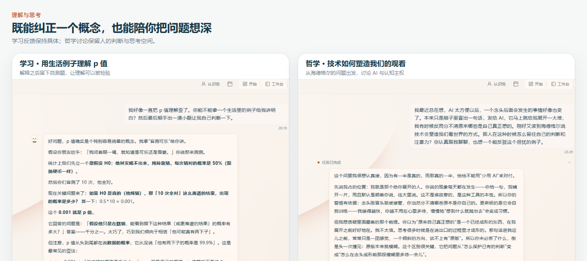
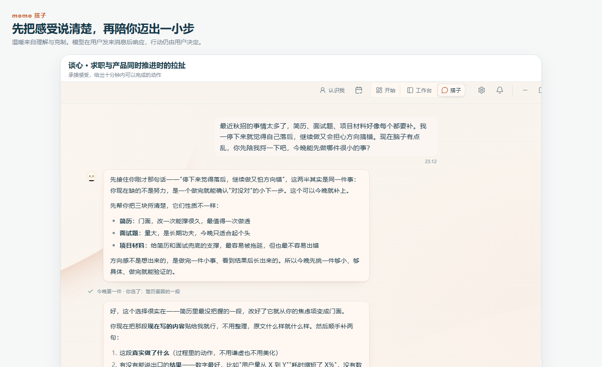
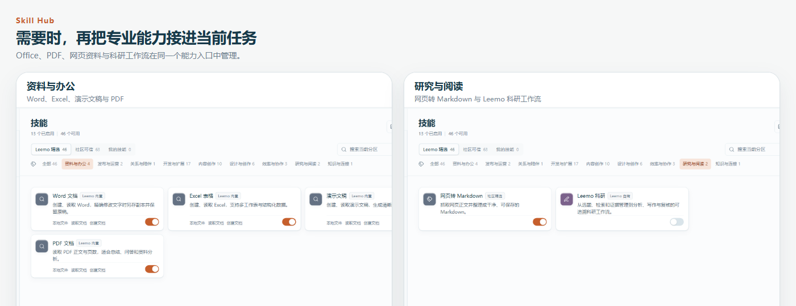

  
  <h1>Leemo</h1>
  
<strong>把零散想法留住，把真实工作接着做下去。</strong>

  
一个本地优先的个人 AI 工作台。你仍然用熟悉的便签、Todo、文档、文件夹和对话工作；需要帮助时，momo 带着当前上下文继续思考或执行。

  

    <a href="https://github.com/CheaperjamRen/leemo/releases/tag/v0.1.5"><strong>下载 Windows 版</strong></a> ·
    <a href="https://github.com/CheaperjamRen/leemo/issues">反馈问题</a>
  

  

    
    
    
    
  

## 第一次听说 Leemo，可以先这样理解

你可能已经用过 ChatGPT、豆包或 Kimi：输入一句话，几秒后收到一段回复。网页聊天很适合问答、写作和临时讨论。

Agent 能继续读取你授权的材料、调用搜索与电脑工具、处理真实文件，并在本地留下可以继续编辑的结果。Leemo 把这些能力放进一套熟悉的桌面工作流：便签、Todo、本地文档、文件夹和对话都能独立使用；当你主动需要 AI 时，momo 会带着当前对象和相关背景接着工作。

Leemo 有三个入口：

| 入口 | 适合做什么 |
| --- | --- |
| **开始** | 记录灵感、整理 Todo、编辑本地文档、找回最近内容 |
| **工作台** | 打开真实文件夹，让 Agent 检索资料、读取文件、调用工具并留下成果 |
| **搭子** | 和 momo 谈心、讨论问题、澄清选择，让一个模糊想法慢慢变清楚 |

三处入口共享同一套本地数据和工作上下文。记录、思考与执行可以自然接续。

## Leemo 为什么出现

AI 让一个念头获得回应的速度变得极快，也让每个念头都很容易继续展开。

> 最开始只是十秒钟的一次走神，最后可能长成两个小时的探索。

准备求职时，突然想到一个产品方向；发给 AI 后，很快得到市场分析、竞品、技术路线和原型建议。两个小时里生成了很多内容，今天真正要推进的简历仍停在原处。这种过程拥有丰富的智力刺激和可见产出，也形成了一种隐蔽的“高生产力拖延”。

AI 还擅长把一个刚出现、仍带着矛盾的念头迅速整理成完整框架。五分钟后文章已经成形，人的思考可能还停留在起点。

> 文章完成了，你的思考可能没有完成。

真实工作也很少沿着一条直线前进。学生、求职者和知识工作者会同时使用便签、Todo、空白文档、本地文件夹和多个 AI 对话。新的想法随时出现，任务会被打断，几天后重新打开项目时，还要寻找最初的目标、当前进度和已经产出的成果。

Leemo 希望把这段连续性保留下来：先安静地留住想法，再回到当前事情；需要帮助时，AI 获得准确上下文；任务结束后，来源、过程、下一步和文件结果仍留在原来的工作空间里。

## 设计哲学：让人决定什么时候轮到 AI 说话

> **AI 原生并不等于 AI 必须一直说话。沉默本身就是能力。**

Leemo 把记录、思考和 Agent 执行组织成彼此相连的空间：

1. **静态工具可以独立使用。** 便签、Todo、本地文档、文件管理和归档拥有完整的普通工具体验。写下一条灵感后，界面保持安静，你可以继续手头的主线。
2. **工作上下文持续存在。** 文档、Todo、会话、运行过程和成果通过来源关系连接。重新打开一个本子时，总体目标、当前阶段、已办步骤、待办和成果仍然清楚。
3. **AI 由用户主动唤起。** 模型调用发生在发送消息、引用对象、选择“问 momo”或进入工作台执行任务之后。momo 已经拥有当前对象的上下文，重复复制材料和解释背景的次数随之减少。
4. **人的原始表达得到保留。** 用户手写内容长期可读，Agent 默认以只读方式使用。改写和加工结果以派生文档、成果或可见修改呈现，并保留来源与撤销路径。

这套约束可以浓缩成两句话：

> **用户仍然按照便签、Todo、本子和对话自然工作；Leemo 在背后保持连续性，并在需要时准确告诉他“你正在做什么、做到哪里、下一步是什么”。**

> **长期可读，默认不扰；手写只读，派生可写。**

人的判断越清楚，AI 越能放大已有能力。目标与方法仍在形成时，一块安静的记录空间能让想法多生长一会儿。

## 一次自然的工作流

### 1. 途中有想法，先收下

读论文、准备面试或处理工作时，按下 `Alt + N` 打开快捷记录。写一句话、列一份清单，或添加一个待办。内容保存在本地，记录结束后继续当前事情。

### 2. 回到开始页整理

收集箱保存尚未归类的记录，文档库承载更长的思考，Todo 保存用户真正决定推进的事项。便签可以继续保留；从文档创建 Todo 时，来源关系也会一起保存。

### 3. 像使用本地云文档一样写作

本地 Markdown 文档支持标题、列表、清单、引用、高亮块、链接、表格、代码、数学公式与图表。左侧文档树负责组织，右侧正文提供接近常规云文档的编辑体验。原文件仍是电脑中的普通文件，也能继续交给其他软件处理。

表格、公式、关联待办与附件保持在同一份本地文档中：

### 4. 需要帮助时，主动交给 momo

在对象菜单中进入搭子，也可以在对话里通过 `@` 引用便签、Todo、文件和本地文档。momo 围绕当前材料回应，相关背景跟随这次交接。

### 5. 需要落地时，进入工作台

打开一个本地文件夹作为本子。Agent 可以在授权范围内检索资料、读取文件、运行命令、操作浏览器与 Windows，并把结果写回这个文件夹。敏感动作会展示审批信息，网络波动会进入可见的重连与重试流程。

一轮任务结束后，概览更新总体目标、当前阶段、执行步骤、待办和成果。Agent 报告已经交付的内容，Todo 的完成状态由用户决定。几天后回来时，文件、来源和工作位置仍然可以继续追溯。

## 你可以用 Leemo 做什么

- **求职准备**：把岗位、简历、面试题和项目材料放进本子，持续更新准备进度，把零散经历整理成有事实支撑的项目表达。
- **科研与阅读**：记录阅读灵感、阅读 PDF、检索来源，把模糊观察变成变量、反例和可验证的研究设计。
- **课程学习**：整理课程资料、纠正常见误解、生成自测题，让理解留下可检查的证据。
- **写作与内容创作**：先在安静文档里保留原始判断，再调用 AI 查资料、找反例、校对或生成派生版本。
- **办公与数据处理**：处理 Word、Excel、演示文稿与 PDF，生成报告、表格、图表和可继续编辑的文件。
- **日常规划**：用便签、Todo 和本地文档管理学习、生活与工作，临时想法先进入收集箱。
- **谈心与选择澄清**：把感受和矛盾说清楚，从一个轻量、可执行的动作重新开始。
- **哲学与深度讨论**：围绕技术、注意力、主体性和价值判断展开讨论，让 AI 承接思考并提供反例。
- **编程与技术项目**：打开代码文件夹，交给 Agent 搜索代码、运行命令、修改文件、调用 MCP 与子 Agent。

### 求职与科研

同一个工作空间可以承载完全不同的知识任务。求职场景关心事实、个人角色、行动、结果和追问题；科研场景关心变量、反例与可验证性。

### 学习与哲学讨论

学习场景可以从一个具体误解开始，解释之后留下自测题。哲学讨论也能保留问题的开放性。图中的哲学问题来自海德格尔技术哲学在当代注意力环境中的延伸讨论：[技术会塑造我们看世界的方式](https://aeon.co/videos/as-technologies-mine-our-attention-we-must-look-to-artists)。

### 和 momo 谈心

搭子态适合讨论、陪伴和澄清。打开搭子页本身保持安静，发送消息后模型开始回复。momo 可以承接感受、梳理选择，也会把最终决定留给用户。

## Claude Code 级的 Agent 能力底座

Leemo 的主 Agent 执行内核建立在 Anthropic 官方的 [`@anthropic-ai/claude-agent-sdk`](https://github.com/anthropics/claude-agent-sdk-typescript) 上。Anthropic 将这套 SDK 定义为以 Claude Code 的能力构建 Agent 的官方工具。

这让 Leemo 获得一套成熟的 Claude Code 级能力：

- 读取、创建和修改真实文件；
- 运行命令、检索代码与验证结果；
- 调用 Web 搜索、浏览器、Windows 操作和 MCP；
- 使用 Skills 与子 Agent 分工处理复杂任务；
- 保持会话连续，执行长任务并展示实时状态；
- 在敏感动作前请求批准，保留失败、重试与恢复信息；
- 把交付物、来源对话、文件变更和任务概览连接起来。

这些能力通过 Leemo 的本子、文件树、审批卡、进度、概览和成果页呈现。普通用户可以从一个自然语言目标开始，也可以随时展开技术细节检查 Agent 做了什么。

模型服务由用户自行选择。Leemo 支持常见国内外模型服务、订阅接入、自定义兼容 API 和本地模型；具体执行质量也会受到所选模型能力影响。

## Skill Hub：把专业方法接进当前任务

Skill Hub 保存可以重复使用的工作方法。Office、PDF、网页资料、科研、内容创作和个人 Skill 都会展示用途、来源与状态；启用后可以在对话中调用。

每项 Skill 仍然使用同一套本地工作区、权限与成果关系。用户可以从社区能力开始，也可以把自己的专业流程保存成个人 Skill。

## 本地文件就是工作空间

Leemo 中的本子对应电脑上的真实文件夹。生成内容以普通文件保存，你可以继续使用 Word、WPS、VS Code、文件资源管理器或其他熟悉的软件打开和编辑。

工作台文件树支持浏览文件夹、预览内容和拖入对话作为附件。全局搜索用于找回历史对话、文件和成果。概览把长任务整理成可恢复的总体视角，详细工具过程保持折叠并可按需展开。

## 权限、模型与数据边界

- 本子、便签、Todo、文档和成果保存在用户电脑中。
- 搭子页进入与普通静态操作保持本地安静状态。
- 模型调用发生在发送消息或明确交给 Agent 处理之后。
- 文件读取、修改、命令执行、网络访问和电脑操作由统一权限设置管理。
- 执行过程会展示正在进行、重试、阻塞、失败和已交付等状态。
- 使用云端模型、搜索或第三方服务时，完成当前请求所需的内容会发送给对应服务。
- API Key 保存在 Electron 主进程，并由 Windows 安全存储保护。
- 用户可以选择每次询问、风险操作询问或完全访问，并在对话中查看当前权限。

## 下载与开始使用

Leemo 当前支持 Windows 10/11 x64。

1. 在 [Leemo v0.1.5 Release](https://github.com/CheaperjamRen/leemo/releases/tag/v0.1.5) 下载安装包。
2. 启动 Leemo，在「设置 → 模型」连接你正在使用的模型服务。
3. 进入搭子，告诉 momo 最近在处理什么；发送消息后模型开始回复。
4. 需要处理本地文件时，进入工作台并打开一个文件夹作为本子。
5. 在任何界面按下 `Alt + N`，随手记录途中出现的想法或待办。

第一条消息可以很简单：

> 我正在准备秋招，手头有简历、岗位记录和面试题。先了解我的经历，再帮我梳理这周最值得推进的事情。

也可以从一个具体文件任务开始：

> 打开这份课程资料，整理重点，并在当前本子里生成一份三天复习计划。

还可以留一段只属于当下的讨论：

> 当 AI 能即时替我扩展一个念头时，我怎样保留自己的判断和注意力？请陪我认真讨论，并给我一个反例。

Leemo 目前处于公开预览阶段。Windows 安装包暂未购买商业代码签名证书；SmartScreen 出现提醒时，请确认文件来自本仓库 Release 页面，并核对 Release 中公布的 SHA-256。

## 反馈

欢迎通过 [GitHub Issues](https://github.com/CheaperjamRen/leemo/issues) 提交问题、使用感受和产品建议。公开反馈中请移除 API Key、账户信息和私人文件。

安全问题请参阅 [SECURITY.md](SECURITY.md)。

## 许可证

Leemo 自有源码采用 [Apache License 2.0](LICENSE)。第三方组件保留各自许可证或使用条款，详见 [THIRD_PARTY_NOTICES.md](THIRD_PARTY_NOTICES.md)。
