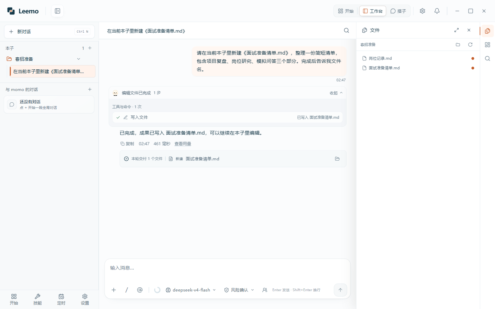
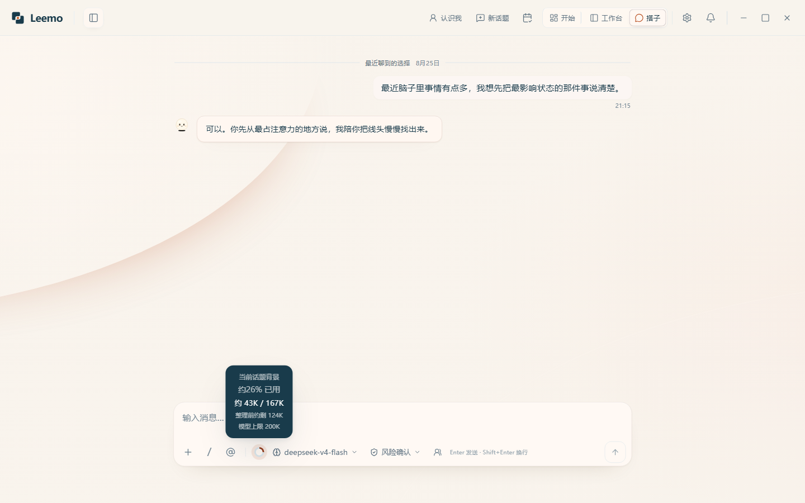
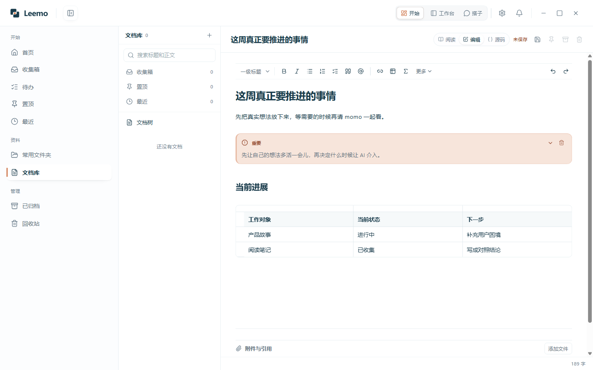
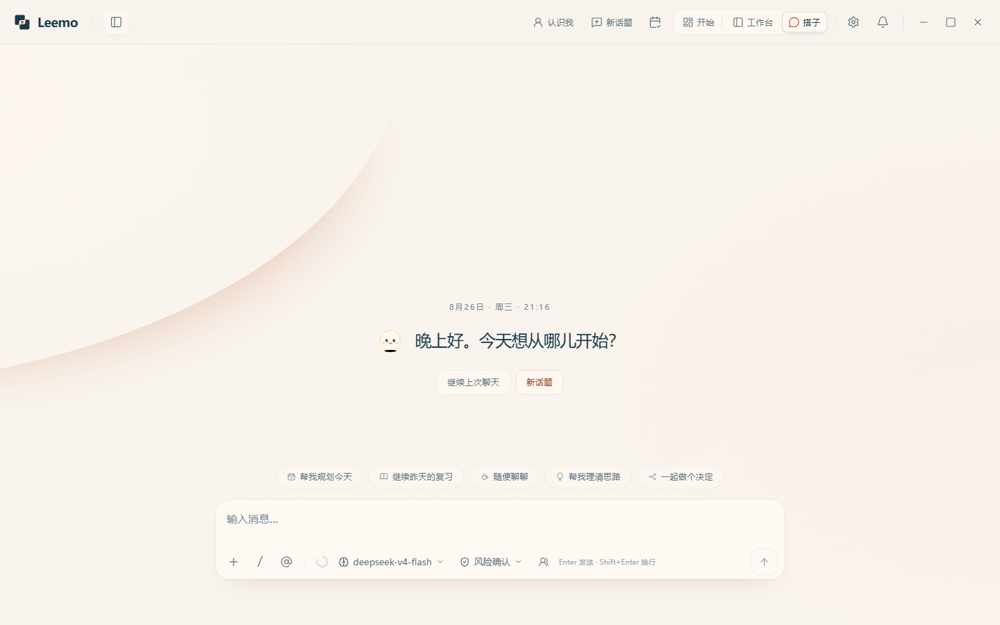
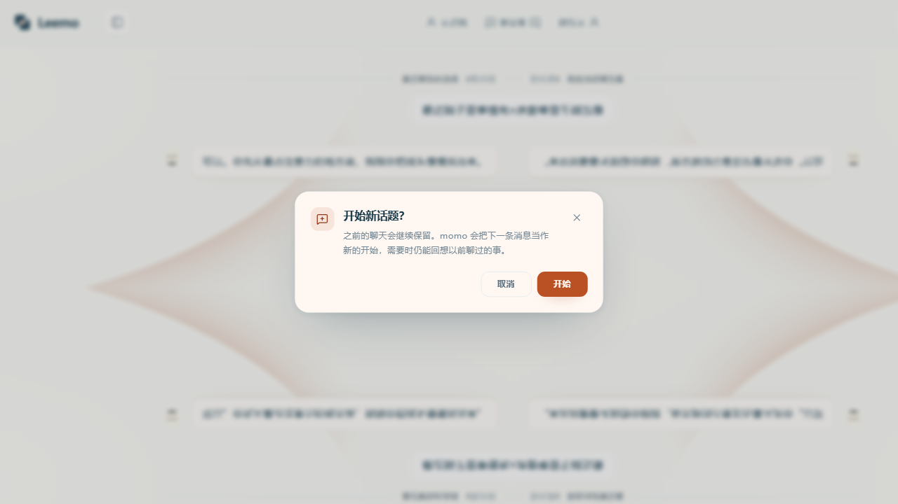
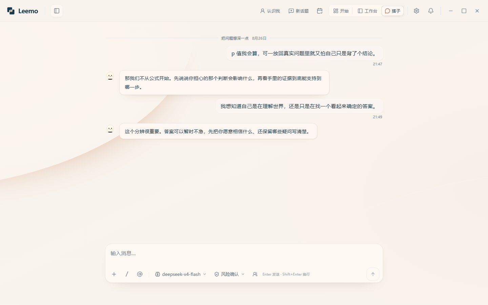
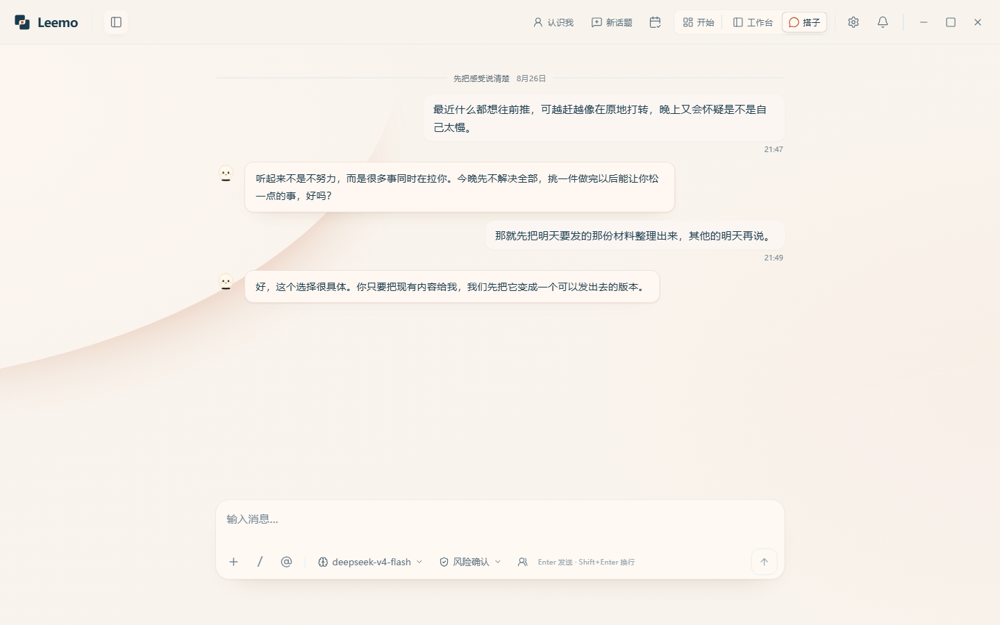
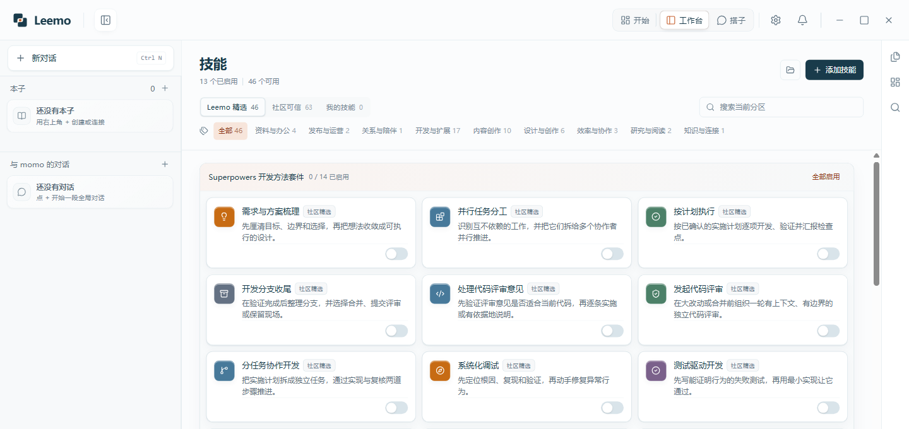

  <h1>Leemo</h1>
  
<strong>本地优先的 Windows AI Agent</strong>

  
把长期对话、本地文档和真实文件夹里的执行放在一个桌面应用里。 基于 Claude Agent SDK，支持工具调用、Skills、MCP、子 Agent 与多模型。

  

    <a href="https://github.com/CheaperjamRen/leemo/releases/latest"><strong>下载 Windows 版</strong></a> ·
    <a href="https://github.com/CheaperjamRen/leemo/issues">反馈问题</a>
  

  

    
    
    
    
  

<table>
  <thead>
    <tr>
      <th width="50%">Agent 执行</th>
      <th width="50%">长期对话</th>
    </tr>
  </thead>
  <tbody>
    <tr>
      <td>读写真实文件、运行工具、Skills、MCP、子 Agent、可验收成果。把目标交给工作台后，执行过程和留下的文件都能检查。</td>
      <td>长期关系流、继续历史、新话题章节、上下文反馈、可管理记忆。回来时可以接着聊，也可以干净地开始另一个话题。</td>
    </tr>
    <tr>
      <td><a href=".github/assets/readme/v0.1.6/06-workbench-overview.png"> 点击图片查看完整界面</a></td>
      <td><a href=".github/assets/readme/v0.1.6/04-buddy-history-context.png"> 点击图片查看完整界面</a></td>
    </tr>
  </tbody>
</table>

## 第一次听说 Leemo，可以先这样理解

Leemo 是一个装在 Windows 电脑上的个人 AI 搭子。想聊时，你可以和 momo 继续上次的话题；要做事时，它能进入你允许的真实文件夹，读取材料、调用工具，并留下可以继续编辑的成果。

你仍然使用熟悉的文档、Todo 和文件夹。Leemo 用三个入口把它们接在一起：

| 入口 | 适合做什么 |
| --- | --- |
| **开始** | 快速记录、整理 Todo、编辑本地文档、找回最近内容 |
| **搭子** | 继续上次聊天、开始新话题、谈心或把一个想法聊清楚 |
| **工作台** | 打开真实文件夹，让 Agent 搜索、修改、运行并交付结果 |

这三个入口共享本地数据、模型能力和工作背景。你不必每次重新复制材料、解释自己做到哪了。

## 为什么会需要 Leemo

**把零散想法留住，把真实工作接着做下去。**

有些念头值得记下，但不值得立刻打断手头的事：

> 等等，简历里这段好像还有个问题……先记一下。

资料、Todo 和 AI 对话多起来后，也很容易出现另一种茫然：

> 我记得做到一半了。上次卡在哪，文件又放哪了？

Leemo 把快速记录、本地文档、momo 对话和文件夹执行连成一条可继续的路径。先收下念头，需要回应时再聊，需要成果时再执行；几天后回来，历史、进度和文件还在原处。

## 从一个念头，到真正留下来的成果

### 1. 先记下，不必先整理

在任何界面按 `Alt + N`，写一句话、列一份清单，或者加一个待办。记录会进入本地收集箱；回到开始页后，再决定它要变成 Todo、文档，还是暂时留着。开始页会把最近内容和正在推进的事情放回眼前。

### 2. 回到本地文档里慢慢想

短记录可以继续长成一份本地 Markdown 文档。标题、列表、清单、引用、表格、代码、公式和图表都保存在普通文件中，既能在 Leemo 里写，也能交给其他软件继续处理。

需要装下表格、清单和更丰富的内容时，仍然写在同一类本地 Markdown 文件里：

### 3. 想聊时，继续上次的话题

打开搭子页，可以继续最近的聊天，也可以先从一句还没想清楚的话开始。momo 在同一条长期关系流里承接历史；话题换了，你可以新开一个章节，让当前上下文保持清楚。

想换一个讨论方向时，点“新话题”会先确认，再进入新的章节：

历史可以回看，实时上下文可以查看，新话题也不会抹掉以前聊过的内容。

### 4. 要产出时，把真实文件夹交给工作台

打开一个本地文件夹作为本子，然后告诉 momo 想完成什么。它可以读取材料、搜索资料、运行命令、操作工具，再把报告、表格、代码或其他结果写回文件夹。工作台会展示文件树、执行过程、权限确认和交付结果。

任务告一段落后，概览保留目标、当前阶段、待办与成果。关闭 Leemo 再回来，仍能从概览、历史对话和本地文件继续；Todo 是否完成，最后由你决定。

## 同一个 momo，两种在场方式

| 在搭子里 | 在工作台里 |
| --- | --- |
| 界面更安静，适合聊天、回看历史、开始新话题、澄清感受和判断 | 信息更完整，适合查看文件、工具状态、权限、进度、概览与成果 |

两处使用的是同一个 momo，也共享 Agent、Skills、MCP、文件和记忆能力。区别只是你此刻需要一段对话，还是一次可以检查结果的执行。

打开搭子页、回看历史或切换话题时，Leemo 不会自己向模型发消息。你发送消息或明确交给 Agent 处理后，模型才开始工作。

## Claude Code 级的 Agent 能力底座

Leemo 的主 Agent 执行内核建立在 Anthropic 官方的 [`@anthropic-ai/claude-agent-sdk`](https://github.com/anthropics/claude-agent-sdk-typescript) 上。它提供 Claude Code 级的能力底座，Leemo 再把已经集成的能力放进本子、搭子和工作台：

- **读取、创建、修改**真实文件，把结果留成普通文件；
- **运行**命令，**搜索**代码与资料，并验证结果；
- **调用**浏览器、Windows 工具、MCP、Skills 与子 Agent；
- 处理长任务，展示进度、权限请求、失败与重试，也支持停止和恢复；
- 连接多种模型服务；最终效果会受到所选模型能力影响。

你可以只说目标，也可以展开工具过程，检查 momo 读取了什么、修改了什么、最后交付了什么。

## 你可以用 Leemo 做什么

- **求职准备**：整理岗位、简历和面试材料，找出表达里缺少的事实，再把修改留回本子。
- **科研与阅读**：阅读 PDF、检索来源、整理变量和反例，把观察推进成可验证的问题。
- **课程学习**：从一个具体误解开始解释，整理笔记、复习计划和自测题。
- **写作与内容创作**：保留自己的原稿，再让 momo 查资料、找反例、校对或生成派生版本。
- **办公与数据处理**：处理 Word、Excel、演示文稿和 PDF，交付可继续编辑的文件。
- **日常规划**：用便签、Todo 和本地文档安排学习、生活与工作，临时想法先放进收集箱。
- **谈心与选择澄清**：把还没说顺的感受慢慢讲出来，再决定眼下最小的一步。
- **哲学与深度讨论**：围绕技术、注意力和价值判断继续追问，也让 momo 提供反例。
- **编程与技术项目**：搜索代码、运行命令、修改文件，并调用 MCP 与子 Agent 处理复杂任务。

一句自然的话就能开始：

> 简历这段我越改越乱……你先帮我看看，到底哪里没讲清楚。

> p 值我每次都会背定义，但一到题里就懵。能不能换个说法？

学习和开放讨论也可以从一个没想明白的问题继续：

谈心也可以只是当下的一句话：

> 我今天什么都不想做，又有点慌。你先别给我列一大堆计划。

## Skill Hub：把专业能力接进当前任务

Skill 是可以重复使用的专业方法。Office、PDF、研究阅读、网页资料和其他 Skills 会说明用途、来源与状态；启用后，momo 可以在当前任务里直接调用，不必重新搭一套工作流。

Skills 仍然使用同一套本地工作空间、权限和成果关系。你可以使用 Leemo 自带或社区提供的能力，也可以把自己的流程保存成个人 Skill。

## 本地文件就是工作空间

Leemo 里的本子就是电脑上的真实文件夹。本地文档和成果是普通文件。本子里的对话和可管理记忆跟着本子保存；全局 momo 的长期关系不属于某一个本子。SQLite 负责本地索引，索引可以从文件重建。

你可以继续用文件资源管理器、WPS、Word、VS Code 或其他熟悉的软件打开和编辑。Leemo 负责把相关对话、进度和成果接起来，不替你接管原来的工作习惯。

> **长期可读，默认不扰；手写只读，派生可写。**

对 Agent 来说，用户手写的原始内容默认只读。需要改写或加工时，momo 会通过派生文档、可见修改或新的成果文件交付，原始表达仍然保留。

## 权限、模型与数据边界

- 本子、便签、Todo、本地文档、对话和成果保存在你的电脑中。
- 发送消息、明确调用 AI 或交给 Agent 执行前，普通记录、编辑和浏览保持在本地。
- 文件读取、修改、命令、网络和 Windows 操作由统一权限设置管理；当前权限和敏感操作确认会在界面中显示。
- 使用云端模型、搜索或第三方工具时，完成当前请求需要的内容会发送给对应服务。
- 模型服务凭据由 Windows 安全存储保护，不会出现在普通界面数据或日志里。
- Leemo 可以连接多种模型服务；模型本身的能力、上下文和服务稳定性会影响最终质量。

## 下载与开始使用

Leemo 当前支持 Windows 10/11 x64，处于公开预览阶段。

1. 从 [最新 Release](https://github.com/CheaperjamRen/leemo/releases/latest) 下载 Windows 安装包。
2. 启动 Leemo，在「设置 → 模型」连接你正在使用的模型服务。
3. 想聊时进入搭子；要处理本地文件时，进入工作台并打开一个文件夹作为本子。
4. 在任何界面按 `Alt + N`，随手记下途中出现的想法或待办。

第一条消息不用正式：

> 我这两天有点乱，你先听我讲讲。

文件任务可以说得更明确一点：

> 这个文件夹里是课程资料。先帮我看看都有啥，再整理一份三天复习计划，结果放回这里。

开放讨论也可以保留犹豫：

> 我有个想法，但还没想清楚……技术会不会也在改变我们怎么看事情？

Windows 安装包暂未购买商业代码签名证书。SmartScreen 出现提醒时，请先确认文件来自本仓库 Release 页面，再核对 Release 中公布的 SHA-256。

## 反馈

欢迎通过 [GitHub Issues](https://github.com/CheaperjamRen/leemo/issues) 提交问题、使用感受和产品建议。公开反馈中请移除模型服务凭据、账户信息和私人文件。

安全问题请参阅 [SECURITY.md](SECURITY.md)。

## 许可证

Leemo 自有源码采用 [Apache License 2.0](LICENSE)。第三方组件保留各自许可证或使用条款，详见 [THIRD_PARTY_NOTICES.md](THIRD_PARTY_NOTICES.md)。
